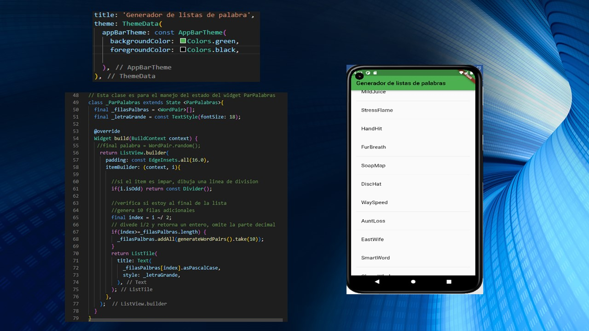

# lista_palabras_app

App Generador de lista de pares de palabras 1

# Tarea 1

# Capturas de pantalla

# Tarea 2

# Capturas de pantalla

# Presentacion

# Practica calificada Marvin Grandez Rojas

# Capturas de pantalla

